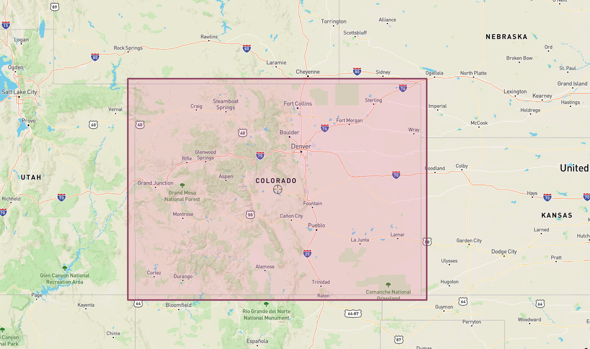
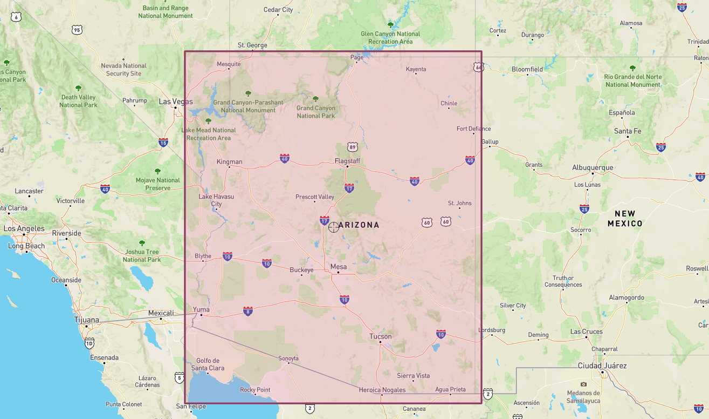
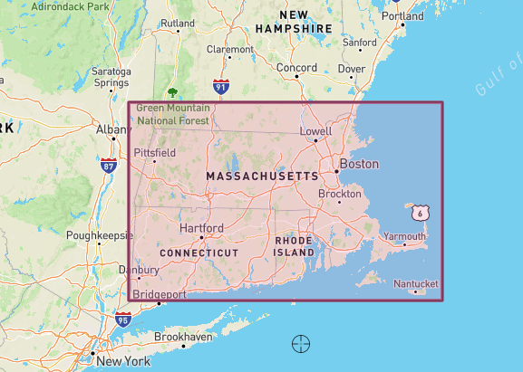

<br />
<p align="center">
  <a href="#">
    
  </a>

  <h1 align="center">LandSAR Search and Rescue Decision Support Tool</h1>
  <h2 align="center">Motion Model Development Quick Start Guide</h2>
</p>


# Background and Setup

This document will overview the steps you need to get started writing a custom motion model for LandSAR. For more information about configuring and customizing the LandSAR system, see the <a href="https://github.com/raytheonbbn/landsar-base/blob/main/README.md">LandSAR Base README</a>.


## Prerequsites 

* Java; we recommend Java 11.
* Git
* Firefox or Google Chrome Web Browser 
* Integrated Development Environment (ex. IntelliJ IDEA, Visual Studio Code, Eclipse)


## Download the Code And Initial Setup

1. Starter Project - (motion-model-demo subfolder in this repository) - includes skeleton structure so you can get started on your motion model plugin
2. LandSAR Base Binaries - https://github.com/raytheonbbn/landsar-base - used to run the LandSAR system, which will run your motion model plugin. This repository requires <a href="https://git-lfs.com/">git-lfs</a>. 
    * LandSAR Base excludes operational models and parameters found in the LandSAR system. 
    * LandSAR is implemented as a client/server application, with a Java-based server and several clients including browser-based and an Android Team Awareness Kit (ATAK) plugin. LandSAR Base only includes the browser-based client. 
3. (Optional) Motion Model Software Development Kit (SDK) - https://github.com/raytheonbbn/landsar-sdk This is already included in the motion-model-demo project.

Open the LandSAR Base Binaries folder, and run `./set-up-LandSAR-BASE.sh` to pull all the required dependencies for LandSAR from the internet.

## Steps to Creating a Motion Model Plugin and Using It with LandSAR Base
1. Open up the Starter Project
2. Implement the `generateInitialDistribution` method, which forms the core of your motion model plugin. You can specify attributes in `getMotionModelParameters`. An overview of Motion Model Methods is provided below; for more information refer to the Motion Model SDK README. When you're getting started, feel free to save the search-related methods for later. 
<table>
<tr>
<th>Method</th><th>Description</th>
</tr><tr>
<td>getMotionModelParameters</td><td>Specify text and/or numeric inputs to your model</td>
</tr><tr>
<td>getMotionModelGeospatialDescriptions</td><td>Specify map inputs to your model</td>
</tr><tr>
<td>validateMotionModelParameters</td><td>indicate whether motion model parameters
are valid. Should return an error status update message to client if invalid.</td>
</tr><tr>
<td>generateInitialDistribution</td><td>Return a sequence of probability distributions
indicating where the lost person is likely to be located at each time step.</td>
</tr><tr>
<td>calculateProbabilityOfSuccess</td><td>should return the probability that the lost person
will be found across all searches computed so far.</td>
</tr><tr>
<td>updateProbabilityDistributionForSearch</td><td>Update the probability distributions generated by your model to reflect a search, assuming the search didn't find the lost person.</td>
</tr><tr>
<td>cancelSearch</td><td>Reverse the effect of updating the probability distribution for a search.</td>
  </tr>
</table>

3. Build your plugin; create a JAR. First, run the PluginManifestGenerator Junit Test: `gradle test --tests 'PluginManifestGenerator'` then build the jar with Gradle: `./gradlew build`  

4. Copy your JAR file over to LandSAR Base's plugins folder: `cp build/libs/motion-model-demo-*.jar [path to]LandSAR_Base/plugins`

5. Edit LandSAR Base's config.json document to add your java class to the loaded plugins in two places. 
The first place is as an entry in the list of plugins for the `UtilityService`. You'll want to add your plugin, with the `name` you want to see in the user interface, and the fully qualified classname of the plugin in the `className` attribute. You may need to add a comma after the prior entry. 

```
         "serviceType":"UtilityService",
         "pluginConfigurations":[
		{
			"name": "Example Plugin A",
			"className": "com.bbn.example.MyPlugin"
		}
```

The second place is around line 183, in the `MotionModelCoordinatorPlugin` in the configuration attribute `motion model plugin names`. This item is a comma-seperated list of plugin names, so add whatever name you selected for your plugin, like `Example Plugin A` to this list:       

Before adding plugin A:
```
"motion model plugin names": "Maritime Plugin",
```
  
  After adding plugin A:   
```  
motion model plugin names": "Maritime Plugin,Example Plugin A",  
```

6. Run LandSAR Base, using either Docker or via the command line with `./startServer.sh`
7. Access the LandSAR Web UI at `https://127.0.0.1:8000/webmap/landsar/`, accept the warning about the self-signed certificate, and sign in with username: `admin`, password: `demotimeBase`. You can then create a new Lost Person Instance with your custom motion model!

### Parameters and Other Notes
You may want to experiment with the built-in LandSAR parameters, or use a different set of Geospaital Data. For the hackathon, we've assembled three areas of Geospatial Data so you can try your model out in different areas. 

Please unzip the data cache file and copy the 'DataCache' folder to the root of your local LandSAR Server, next to the config file.

These caches support Landcover, Elevation, and Riverine data.

<b>Colorado</b> Latitude: 36.897 to 41.096, Longitude: -109.226 to -101.909
<a href="http://bboxfinder.com/#36.897194,-109.226074,41.095912,-101.909180">
  
</a>


<b>Arizona</b>  Latitude: 31.166 to 37.09, Longitude: -114.961 to -108.918
<a href="http://bboxfinder.com/#31.165810,-114.960938,37.090240,-108.918457">
  
</a>


<b>Massachusetts</b> Latitude: 41.195 to 42.977, Longitude: -73.575 to -69.774
<a href="http://bboxfinder.com/#41.195190,-73.575439,42.976521,-69.774170">
  
</a>

To use, update the LandSAR Base Config: config.json.
1. Update the "geo cache directory" parameter in the 'MotionModelCoordinatorPlugin' config to point to one of the above caches, e.g. for Arizona:  
"geo cache directory": "DataCache/Arizona"
2. Finally, make sure the "area data types cache" is set:  
"area data types cache":"Riverway,Elevation,Landcover"

See the <a href="https://github.com/raytheonbbn/landsar-base/blob/main/README.md">LandSAR Base README</a> and the <a href="https://github.com/raytheonbbn/landsar-sdk/blob/main/README.md">Motion Model SDK README</a> for more information.
